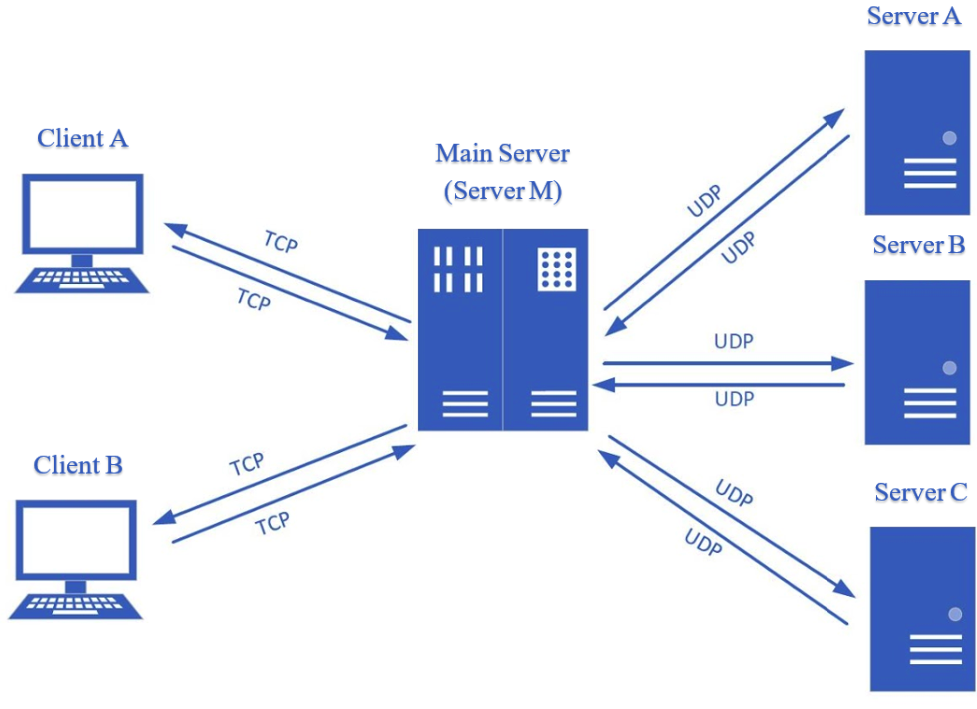

# **Abstract:**

The blockchain consists of a central server (ServerM), 3 backend servers (ServerA, ServerB, ServerC), 2 clients (clientA, clientB).
Client starts a TCP connection with central server M, which will query info with help of backend servers via UDP connections. 
About 3 backend servers, they each manage a text file as a backing store all history of money transactions. Client is able 
to check wallet balance, request money transfer to another client, ask central server to download all transactions and stat summary
of all transactions related with certain user.

# Files:
### Self coded HashTable:

1. Yida_HashMap.c

### Servers: 
1. serverM.c (central server)
2. serverA.c (manage block1.txt)
3. serverB.c (manage block2.txt)
4. serverC.c (manage block3.txt)

### Clients: 
1. clientA.c
2. clientB.c

### Backing Store (block#.txt): 

sequence# (unsorted)--SenderName--ReceiverName--Amount

(each person has 1000 dollars to begin)

# Usage: 
Compile: make all

Open 4 terminals and run servers in this order: ./serverM ./serverA ./serverB ./serverC (to stop, press ctrl+c)

**(Need to run clientA and clientB interchangeably, e.g. ./clientA, ./clientB, ./clientA ....)**
1. To check balance: ./clientA [user name] or ./clientB [user name]
2. To request amount transfer: ./clientA [sender name] [receiver name] [amount]  or ./clientB [sender name] [receiver name] [amount]
3. To download a sorted transaction history from beginning of blockchain: ./clientA [TXLIST] or ./clientB [TXLIST]
4. To view transfer frequency report at client console: ./clientA [user name] stats or ./clientB [user name] stats

# Error Handling:
For balance check, if given usr name doesn't belong to network.
For money transfer, if insufficient amount / if one user doesn't belong to network / both user don't belong to network

# Future thought: 
This is a toy TCP/UDP socket programming using loop back IP address for experience basic network related system call. 
In reality, packet over network can be lost due to many factors. 

I'd love to explore how to build processes on host with public IP address in the future. Also, I'd love to learn some C/CPP 
GUI programming to turn terminal client into user friendly client to send message or binary data via client-server architecture.